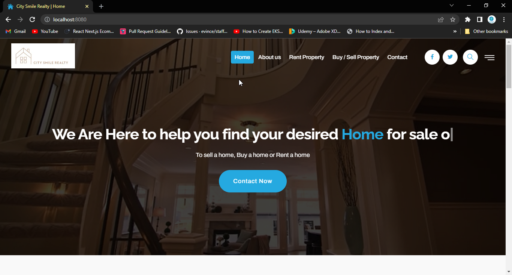

<h1 align="center"> City Smile Realty Web Application </h1> <br>


## Table of Contents

- [Introduction](#introduction)
- [Features](#features)
- [Requirements](#requirements)
- [Quickstart](#quick-start)
- [Screenshot](#documentation)


## Introduction

City Smile Realty: Is a Real Estate Market Place. You can Search millions of for-sale and rental listings.


## Features
Here are some of the features:
- Add Property for rent and sale
- Delete Property
- Edit Property

## Technology Used
- Golang
- Gonic Gin
- CSS
- Javascript
- HTML

## Running the App
Perform the following steps to run the application:

1- Clone the App

```
git clone https://github.com/Surdy-A/City-Smile-Realty.git
``` 

2- Change directory into the City-Smile-Realty and run

```
go run main.go
``` 

## Layout

```tree
├── .gitignore
├── README.md
├── assets
│   ├── css
│   ├── fonts  
│   ├── images
│   ├── js
│   └── videos
├── handlers
│   └── house.go 
├── models
│   └── house.go
├── repo
│   └── house.go
├── templates
│   ├── template
├── Uploads
│   ├── upload
├── utils
│   ├── util.go
└── |
    
## Screenshot
#Home Page


#House List for Rent



## About the project
